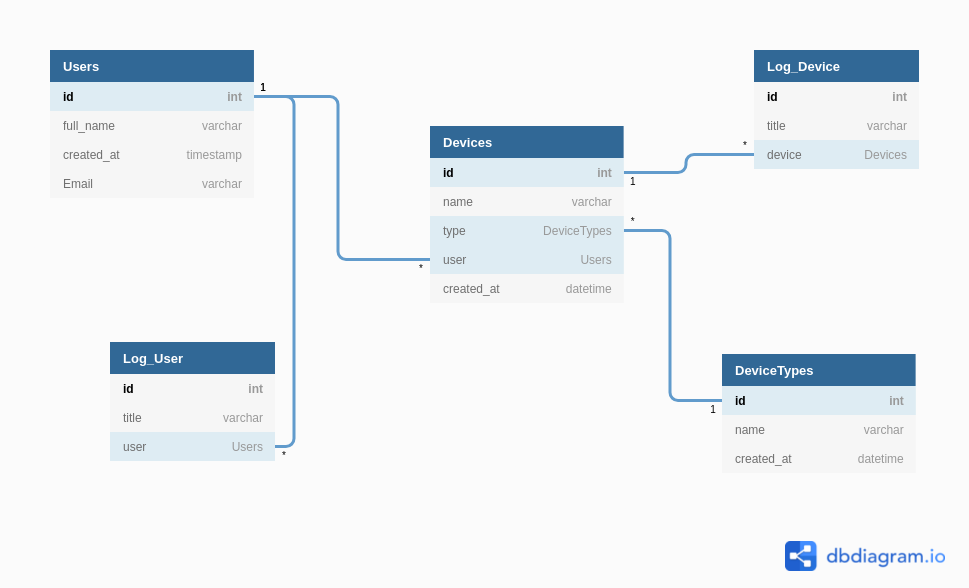

# Django-Company

<hr>

### Project Setup

```
$ git clone https://github.com/anubhavitis/Django-Company
$ cd Django-Company
$ pipenv install
$ pipenv shell
$ python3 manage.py runserver

Termical 2:
$ sudo systemctl start rabbitmq-server
$ celery -A config worker -l INFO

// Backend sever will be hosted on 127.0.0.1:8000
// Goto https://127.0.0.1:8000/doc for documentation
```
<hr>
### Database ER diagram

